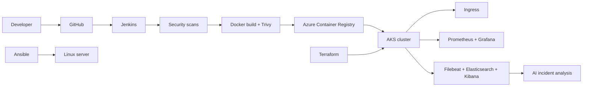

# AI-Powered E-Commerce DevOps & Cloud-Native Delivery Platform

DevOps internship project at **Davine Technologies** by **Suraj Chaudhari**.

The goal is not to build the application, but to build a complete, automated, secure, observable and repeatable delivery platform around an existing e-commerce frontend (**Nexvion**), running on **Microsoft Azure**.

## Architecture



See [docs/architecture.md](docs/architecture.md) for details.

## Tech stack

| Area | Tool |
|---|---|
| OS / automation | Linux (Ubuntu on WSL2), Bash |
| Source control | Git, GitHub (main / develop / feature branches, pull requests) |
| Web server | Nginx (unprivileged) |
| Containers | Docker, Docker Compose |
| CI/CD | Jenkins (declarative pipeline, Poll SCM) |
| Infrastructure | Terraform (Resource Group, ACR, AKS) |
| Configuration | Ansible (roles: common, docker, hardening) |
| Orchestration | Kubernetes (AKS), Helm, Nginx Ingress |
| Monitoring | Prometheus, Grafana (kube-prometheus-stack) |
| Logging | Filebeat, Elasticsearch, Kibana |
| DevSecOps | Trivy (fs + image), Gitleaks, hardened image and pod security context |
| AI | Rule-based incident analyzer with optional local LLM (Ollama) |
| Cloud | Microsoft Azure (Azure for Students) |

## Repository structure

## Quick start (local)

```bash
docker compose -f docker/docker-compose.yml up -d --build
curl http://localhost:8081/health      # OK
```

Cloud deployment is described in [docs/deployment.md](docs/deployment.md).

## CI/CD pipeline

`Checkout -> Security Scans (Gitleaks, Trivy fs) -> Build Image -> Image Scan (Trivy, fails on fixable CRITICAL) -> Azure Login -> Push to ACR -> Deploy to AKS (helm upgrade --install, rolling update) -> Health Check`

A merge into `develop` triggers the pipeline automatically (Poll SCM, every ~5 minutes).

## Security (DevSecOps)

- Secret scanning: Gitleaks
- Dependency / config scanning: Trivy filesystem scan (the app is static, so "dependencies" are the base image packages)
- Image scanning: Trivy image scan, pipeline fails on fixable CRITICAL findings
- Hardened image: `apk upgrade`, runs as non-root user (uid 101)
- Pod security: runAsNonRoot, no privilege escalation, all capabilities dropped, seccomp RuntimeDefault
- Secrets: Kubernetes Secret, Jenkins credentials, nothing sensitive in Git (.gitignore for tfstate/tfvars)
- Linux hardening: Ansible role (sysctl settings, unattended upgrades, SSH settings where sshd exists)
- Trivy result: 42 findings (40 HIGH, 2 CRITICAL) before hardening, after hardening: <fill from Jenkins build console>

## AI-assisted incident analysis

`ai/incident-analysis/analyze.py` reads logs (file or Elasticsearch) and reports: error classification, severity, possible root cause and suggested remediation. The default engine is rule-based. An optional `--llm ollama` flag adds a summary from a local LLM.

## Known limitations

- The application is a frontend-only demo (login and payment use localStorage), so there is no backend or database.
- Jenkins runs on a laptop (WSL), not in Azure. GitHub webhooks cannot reach it, so Poll SCM is used.
- Elasticsearch runs as a single node with security disabled (demo only).
- Terraform state is stored locally, not in a remote backend.
- Grafana and Kibana are reached through `kubectl port-forward`, not exposed publicly.
- Blue-Green and Canary strategies are not implemented. Rolling update and Helm rollback are demonstrated.
- The Ansible target is the local WSL machine, so the SSH hardening tasks are skipped (no sshd there).
- The AI analyzer is rule-based by default, it is not a trained model.

## Cost note

The AKS cluster is stopped when not in use:
`az aks stop -g rg-nexvion-dev -n aks-nexvion-dev`
