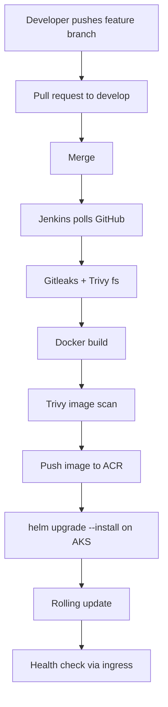
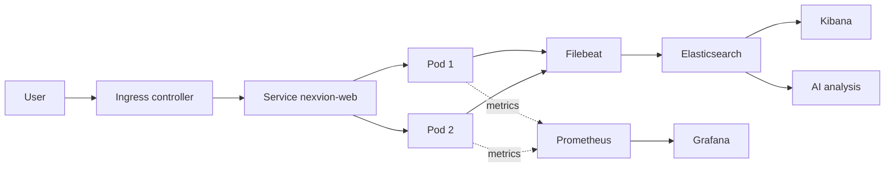

# Architecture

## Layers

| Layer | Component | Role |
|---|---|---|
| Source | GitHub | Single source of truth, branching, pull requests |
| CI/CD | Jenkins | Builds, scans, pushes and deploys on every merge to develop |
| Registry | Azure Container Registry | Stores versioned images (nexvion-web:vN) |
| Infrastructure | Terraform | Creates Resource Group, ACR and AKS as code |
| Configuration | Ansible | Configures the Linux server (packages, user, directories, Docker access, hardening) |
| Runtime | AKS + Helm | Runs the app: 2 replicas, rolling update, probes, ConfigMap, Secret |
| Access | Nginx Ingress | Single public entry point |
| Monitoring | Prometheus + Grafana | Metrics and dashboards (CPU, memory, pods, nodes) |
| Logging | Filebeat + Elasticsearch + Kibana | Central collection and search of container logs |
| AI | analyze.py | Classifies incidents and suggests remediation |
| Security | Trivy, Gitleaks, pod security context | Checks inside the delivery flow |

## Delivery flow

## Runtime flow

## Azure resources

| Resource | Name |
|---|---|
| Region | indiasouthcentral (allowed by the student subscription policy) |
| Resource group | rg-nexvion-dev |
| Container registry | acrnexvionz034e |
| AKS cluster | aks-nexvion-dev (2 nodes, Standard_B2s_v2) |

## Kubernetes namespaces

- `nexvion`: application (Helm release `nexvion`)
- `ingress-nginx`: ingress controller
- `monitoring`: Prometheus and Grafana (Helm release `monitoring`)
- `logging`: Elasticsearch, Kibana, Filebeat
